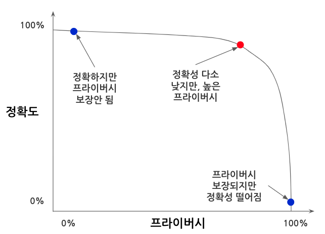
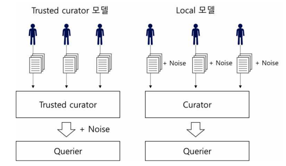
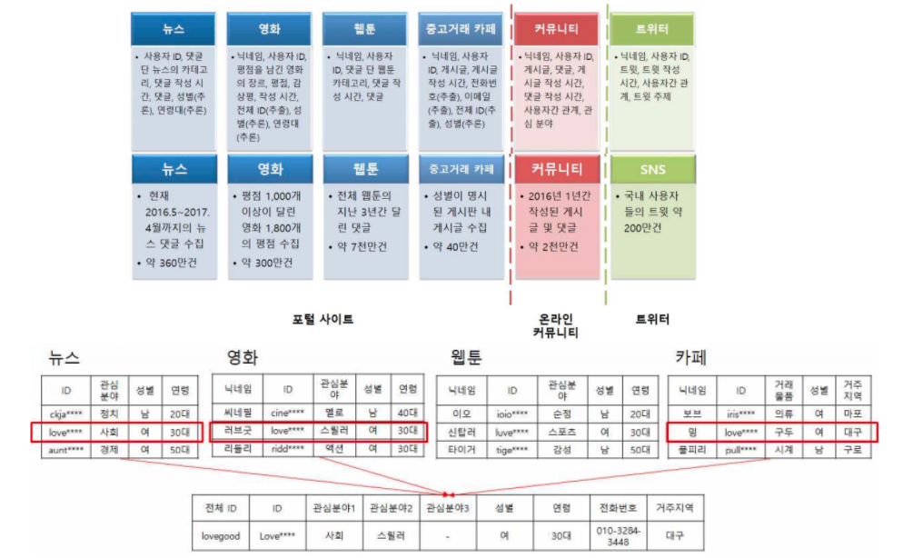

```{r setup, include=FALSE}
knitr::opts_chunk$set(echo = TRUE, message=FALSE, warning=FALSE,
                      comment="", digits = 3, tidy = FALSE, prompt = FALSE, fig.align = 'center')

```

<iframe width="300" height="180" src="https://www.youtube.com/embed/pT19VwBAqKA" title="YouTube video player" frameborder="0" allow="accelerometer; autoplay; clipboard-write; encrypted-media; gyroscope; picture-in-picture" allowfullscreen>

</iframe>

# 차분 프라이버시 {#dp}

차분 프라이버시(Differential Privacy)는 프라이버시를 정량적으로 모델화하여 프라이버시 보호 정도를 측정할 수 있는 기술·방법론으로 데이터의 분포 특성을 유지하여 데이터의 유용성(Utility)은 유지하면서도 개인정보를 보호하기 위해 잡을 추가하는 기법이다. 즉 프라이버시를 일부 희생하면서 원본 데이터와 마찬가지로 높은 정확성을 갖는 특성을 갖도록 데이터를 익명화시키는 것이 중요하다. 왜냐하면, 프라이버시와 데이터의 유용성 즉, 정확도는 상호 주고받는 트레이드 오프(Trade-off)가 존재하기 때문이다.



## DP 얼개 {#dp-framework}

차분 프라이버시를 구현하는 프레임워크로 크게 "지역 모델"과 "Trusted Curator 모델"이 있다.

-   **신뢰할 수 있는 큐레이터 모델**: 전체 데이터를 취합하여 노이즈 삽입 수준을 결정할 수 있으므로 데이터 유용성과 프라이버시 보호에 있어 효율적이나, 해당 작업을 처리하는 큐레이터를 신뢰해야 한다는 단점이 있다.
-   **지역 모델**: 개인이 노이즈를 삽입하여 큐레이터에게 전송하므로 신뢰할 수 있는 큐레이터의 존재가 필요하지 않아 개인의 프라이버시를 원천적으로 보호할 수 있어 구글 및 애플에서 채택하고 있다. 그러나 신뢰할 수 있는 큐레이터 모델에 비해 데이터 유용성이 크게 저하될 수 있으며, 현재의 지역 모델에서는 사용자가 임의로 노이즈 삽입 수준을 결정할 수 없다는 단점이 있다.



## 외부 공개 정보 위험 [@park2017] {#dp-example}

국내 웹 이용자의 대부분이 포털사이트에서 제공하는 뉴스, 카페, 블로그, 웹툰, 영화 등의 서비스와 온라인 커뮤니티에서 제공하는 게시판 서비스를 사용하고 있고 이를 조합하게 되면 특정 사용자를 식별하는게 가능하다. 비식별 데이터를 연계하게 되면 공통 ID를 중심으로 확장된 개인정보 추출 및 복원이 가능하다.



# 비식별화 실패 사례 [@kim2017] {#failure-privacy}

개인정보가 가려졌다고 판단되어 공개된 데이터 중 일부는 다양한 비식별화기법에 의해 무용지물이 된 사례가 있다. 대표적으로 거론되는 글로벌 사례로 AOL, Netflix, 마사추세츠 의료기록 데이터베이스가 회자된다.

준식별자(Quasi- identifier, QID)인 우편번호, 성별, 생일 만으로 미국 인구의 87%가 재식별화가 가능함이 Sweeny에 의해 밝혀져 식별자(Identifier, ID)가 제거된 데이터라도 안전하지 않음이 확인되었다. K-익명성은 QID(Quasi-Identifier)로 재식별화를 방지하기 위해서 적어도 해당 그룹에 적어도 K명이 존재하기 때문에 $\frac{1}{k}$ 만큼의 안정성을 보장한다.

인터넷 미디어 스트리밍 서비스를 제공하는 넷플릭스(Netflix)는 사용자들의 성향을 분석해 보다 나은 미디 어 추천 서비스를 제공하기 위해 기존의 모델을 통해 비식별화 된 데이터를 공개하고 이를 이용해 가장 효율 적인 추천 시스템을 만든 팀에게 100만 달러를 수여하 는 Netflix prize를 개최하였다. 하지만 이는 동일한 서비스를 제공하는 IMDB사에서 공개한 비식별화 된 데이터베이스와의 연결(linkage)로 인해 재식별화가 가능함이 발견되었다. [@narayanan2008robust]

메사추세츠 보험 위원회(Massachusetts Group Insurance Commission, GIC)의 비식별화 된 의료기록 데이터 베이스 역시 유권자 등록 데이터베이스와의 연결로 인해 재식별화 되었다.[@ohm2009broken]

교차검색을 통한 재식별화의 가능성을 차단하지 못하고 AOL은 심각한 실수를 저질렀다. '재식별화'는 비식별화된 정보를 조합, 분석 또는 처리하는 과정에서 개인정보가 재생성 되는 것을 말한다. 뉴욕타임즈의 기자 2명이 AOL이 대중에 공개된 검색기록을 검토한 뒤 이것을 사용 가능한 다른 데이터와 교차검토하여 검색사용자의 신원 찾아낸 것이다. [@barbaro2006face]

# 핵심 개념 [@park2018dp] [^1] {#dp-math}

[^1]: [Differential privacy from Wikipedia](https://en.wikipedia.org/wiki/Differential_privacy)

$x$명에 대한 차이가 있는 $D_1$, $D_2$ 데이터셋에 대해 $\mathcal{A}$ 알고리즘이 $\epsilon$ 차분 프라이버시를 제공한다고 다음과 같이 정의한다.

$$\Pr[\mathcal{A}(D_1) \in S] \leq \exp\left(\epsilon\right) \cdot \Pr[\mathcal{A}(D_2) \in S]$$ 직관적으로 $\epsilon$이 0이 되면 $\exp\left(\epsilon\right) = 1$ 이 되어 전혀 프라이버시가 보장되지 않는 상황이 되고 그 반대로 큰 값을 갖게 되면 식별이 더 어렵게 되는 특성을 갖게 된다.

차분 프라이버시는 프라이버시 예산(Privacy Budget)을 도입하여 정보 공개에 따른 프라이버시 손실을 계량화시켰고, 차분 프라이버시는 원래 제작될 때 대용량의 데이터를 염두에 두고 개발이 되었다. 프라이버시 예산은 $\epsilon$으로 표기하고 프라이버시 유출과 다음과 같은 관계가 성립한다.

-   $\epsilon$ ↓ → 프라이버시 손실 줄어듦, 잡음이 많은 데이터
-   $\epsilon$ ↑ → 프라이버시 손실 많아짐, 잡음이 적은 데이터

프라이버시 예산이 적다는 것은 $\epsilon$이 작다는 의미가 되며 프라이버시 손실이 적어져 가장 적은 정보가 제공되고 따라서 잡음이 많은 데이터 제공 의미가 된다. 반대로 프라이버시 예산이 많다는 것은 $\epsilon$이 크다는 의미가 되며 프라이버시 손실이 커져 가장 많은 정보가 제공되고 따라서 잡음이 적은 데이터 제공 의미가 된다.

따라서, 해당 데이터에 대해서 더 많은 프라이버시 보호를 위해서는 프라이버시 예산 $\epsilon$을 줄여야 한다.

## 전역 민감도 {#sensitivity}

차분 프라이버시에서 **전역 민감도(Global Sensitivity)**는 특정 개인을 삽입 혹은 제거했을 때 생기는 변화량의 최대값, 즉 최악의 경우를 가정한다. 따라서, 데이터의 경계가 모호하거나 이상치가 큰 경우 민감도를 설정하기 어렵거나 지나치게 큰 값이 설정되는 문제도 함께 있다.

-   작은 전역 민감도는 결국 잡음을 적게 만든다.
-   큰 전역 민감도는 결국 잡음이 많게 된다.

전역 민감도는 다음과 같이 계산된다.

-   관측점 : `n`
-   데이터 상한: `b`
-   데이터 하한: `a`
-   비율: $\frac{1}{n}$
-   평균: $\frac {b-a}{n}$
-   분산: $\frac{(b-a)^2}{n}$

## 라플라스 분포 {#laplace-distribution}

`rmutil` 팩키지에서 라플라스 분포 특성을 살펴보자. 중심 모수는 $\mu$, 형태 모수(shaping)는 $s$ 가 된다.

```{r laplace-distribution}
library(tidyverse)

x_seq_vec     <- seq(-5, 5, length=1000)
y_laplace_den <- rmutil::dlaplace(x_seq_vec, m = 0, s = 1)

laplace_tbl <- tibble(x = x_seq_vec,
                      y = y_laplace_den)

laplace_tbl %>% 
  ggplot(aes(x= x, y= y)) +
    geom_line() +
    theme_bw(base_family = "NanumGothic") +
    labs(x = 'x', y = 'p(x)', title = "라플라스 분포")
```

중심 모수 $\mu$ 가 0, 형태 모수 $s$ 가 1 인 라플라스 분포에서 난수를 1,000개 추출해보자.

```{r laplace-smpl}
laplace_smpl_tbl <- tibble( smpl = rmutil::rlaplace(1000, m = 0, s =1) )

laplace_smpl_tbl %>% 
  ggplot(aes(x = smpl)) +
    geom_histogram(aes(y = ..density..), fill = "grey", binwidth = 0.5)
```

차분 프라이버시와 연관된 라플라스 분포는 다음과 같이 정의된다. 중심값은 정해져 있다고 보고, 형태 모수를 전역 민감도($S(f)$)와 프라이버시 예산 ($\epsilon$)으로 다음과 같이 정의한다.

$\text{Laplace} \left( \frac{S(f)}{\epsilon} \right)$

즉, 전역 민감도($S(f)$)가 작아지고 &drarr; 프라이버시 예산 ($\epsilon$)이 증가 &uarr; 하게 되면 프라이버시 정보가 담긴 그대로 제공될 가능성이 크고, 반대로 전역 민감도($S(f)$)가 커지고 &urarr; 프라이버시 예산 ($\epsilon$)이 감소 &darr; 하게 되면 프라이버시 정보가 담긴 그대로 제공될 가능성은 줄어든다.


```{r laplace-smpl-viz}
library(patchwork)
draw_laplace_plot <- function(gs, epsilon, color) {

  x_seq_vec     <- seq(-5, 5, length=1000)
  y_laplace_den <- rmutil::dlaplace(x_seq_vec, m = 0, s = gs / epsilon)
  
  laplace_tbl <- tibble(x = x_seq_vec,
                        y = y_laplace_den)
  
  laplace_tbl %>% 
    ggplot(aes(x= x, y= y)) +
      geom_line(color = color) +
      theme_bw(base_family = "NanumGothic") +
      labs(title = glue::glue("전역 민감도: {gs}, 프라이버시 예산: {epsilon}"))
}

p1 <- draw_laplace_plot(1, 1, "black")

p2 <- draw_laplace_plot(1, 5, "blue")

p3 <- draw_laplace_plot(5, 1, "red")

p4 <- draw_laplace_plot(3, 5, "green")

(p1 + p2) / (p3 + p4)
```

라플라스 분포에서 난수를 `rmutil` 팩키지 `dlaplace()` 함수를 사용했지만 [`smoothmest`](https://cran.r-project.org/web/packages/smoothmest/) 팩키지 double exponetial 분포 즉, 라플라스 분포 난수 생성 함수 `rdoublex()`를 사용해도 동일한 결과를 얻을 수 있다.

## 구성가능성 {#composibility} 

데이터에 대한 질의가 거듭될수록 추가적인 정보 노출이 발생하므로 차분 프라이버시에서는 질의(query)를 수행할 수 있는 한계치를 정하는데 이를 프라이버시 예산(privacy budget, $\epsilon$)으로 조정하는데, 질의가 순차적으로 여러 번 수행되거나 데이터의 층화/그룹 집합에 대해 질의가 수행될 다른 접근법을 제시한다.

1. 순차 구성(Sequential composition): 데이터에 순차적으로 여러번 질의(query)가 발생될 때 해당 쿼리 수만큼 프라이버시 예산을 나눠 처리한다. 즉, 프라이버시 예산 $\epsilon$은 $\sum_{i}(\epsilon_i )$가 된다.

2. 병렬 구성(Parallel composition): 데이터에 대한 쿼리가 전체 영향을 받는 것이 아니라 성별에 따라 달리 쿼리가 발생할 경우 최대 프라이버시 예산을 사용한다. 즉, 프라이버시 예산 $\epsilon$은 $\text{max}(\epsilon_i )$가 된다.


# 적용 사례 {#case-study}

`smoothmest` 팩키지 `rdoublex()` 라플라스 분포 난수 생성기를 사용할 때 특정해야되는 인수는 다음과 같다.

- `rdoublex(**x**, statistics, global sensitivity / epsilon)`: 생성할 난수 갯수
- `rdoublex(x, **통계량**, global sensitivity / epsilon)`: 프라이버시를 반영할 통계량
- `rdoublex(x, 통계량, **전역 민감도 / 프라이버시 예산**)`: 형태 모수로 전역 민감도를 프라이버시 예산 즉 $\epsilon$ 으로 나눈 값.

## 빈도수 {#frequency-case}

통계량 중 하나인 빈도수를 프라이버시 예산과 전역 민감도를 조정하여 차분 프라이버시를 적용하여 데이터를 공개해보자. 

```{r frequency}
library(smoothmest)

dp_count_hist <- function(privacy_budget = 0.1) {
  tlt_votes <- rbinom(100, size = 1, prob = 0.5) 

  private_votes <- rdoublex(100, sum(tlt_votes), 1 / privacy_budget) %>% round(digits = 0)
  
  count_tbl <- tibble(private  = private_votes)
  
  count_tbl %>% 
    ggplot(aes(x = private)) +
      geom_histogram(aes(y = ..density..), fill = "gray70") +
      geom_density() +
      geom_vline(xintercept = 50, linetype = "dashed", color = "blue") +
      theme_bw(base_family = "NanumGothic") +
      labs(title = glue::glue("프라이버시 예산: {privacy_budget}"))
}

dp_count_hist(0.1) / dp_count_hist(1) / dp_count_hist(3)
```

## 비율 {#proportion-case}

통계량 중 하나인 비율에 대해 프라이버시 예산과 전역 민감도를 조정하여 차분 프라이버시를 적용하여 데이터를 공개해보자. 
$p=0.5$ 를 비율값으로 두고, 프라이버시 예산을 달리하여 비율 통계량을 비식별화해서 공개해보자.

```{r proportion}

dp_proportion_hist <- function(privacy_budget = 0.1) {
  
  global_sensitivity_prop <- 0.01
  
  tlt_votes <- rbinom(100, size = 1, prob = 0.5) 

  private_vote_rate <- rdoublex(100, mean(tlt_votes), global_sensitivity_prop / privacy_budget)
  
  prop_tbl <- tibble(private  = private_vote_rate)
  
  prop_tbl %>% 
    ggplot(aes(x = private)) +
      geom_histogram(aes(y = ..density..), fill = "gray70") +
      geom_density() +
      geom_vline(xintercept = 0.5, linetype = "dashed", color = "blue") +
      theme_bw(base_family = "NanumGothic") +
      labs(title = glue::glue("프라이버시 예산: {privacy_budget}"))
}

dp_proportion_hist(0.1) / dp_proportion_hist(1) / dp_proportion_hist(3)
```

동일한 방식으로 연속형 변수의 평균과 분산에 대해서도 프라이버시 예산과 민감도를 반영하여 비식별화된 데이터를 공개할 수 있다.


# 모수, 비모수 가공 데이터 {#laplace-extension}

## 라플라스 Sanitizer {#laplace-sanitizer}

라플라스 Sanitizer는 라플라스 메커니즘을 확장한 것으로 병렬 구성(Parallel Composition)을 결합시켜 히스토그램 혹은 분할표(Contingency Table)에 활용하는데 별도로 프라이버시 예산에 손을 댈 필요는 없다.

먼저 세가지 정당 투표수를 구하는 경우를 상정해보자. 먼저 특정 선거구에서 비밀 여론조사를 통해서 다음과 같이 득표를 했다고 가정하자.

- 민주당: 37 표
- 국민의힘: 30 표
- 정의당: 5 표

상기 데이터를 라플라스 Sanitizer 를 적용하여 특정 선거구 가공 데이터를 만들어보자.

```{r assume-party}
# 기본 설정 -----
epsilon <- 0.1
global_sensitivity <- 1

# 라플라스 메커니즘 -----
minju_party   <- rdoublex(1, 37, global_sensitivity / epsilon) %>% max(0)
people_party  <- rdoublex(1, 30, global_sensitivity / epsilon) %>%	max(0)
justice_party <- rdoublex(1, 5, global_sensitivity / epsilon) %>% 	max(0)

# 정당별 데이터 합성 -----
minju_synth <- rep("minju", 37)
people_synth <- rep("people", 30)
justice_synth <- rep("justice", 5)

# 정당별 투표 가공 데이터 -----

votes_synth <- c(minju_synth, people_synth, justice_synth)

tibble(votes = votes_synth) %>% 
  count(votes) %>% 
  mutate(prop = n / sum(n))
```

## 이항분포 {#laplace-binomial}

특정 지역 여론조사 결과를 바탕으로 가공데이터를 만들어내는 것을 실습해보자.

```{r binomial-example}
set.seed(777)
# 가상의 특정 지역 여론조사 결과
polls <- rbinom(100, 1, prob = 0.37)

# 기본 설정 -----
n <- length(polls)
epsilon <- 0.1
gs_prop <- 1 / n

# 라플라스 메커니즘 -----
polls_prop_dp <- rdoublex(1, mean(polls), gs_prop / epsilon) 

# 가공 데이터 생성 -----
polls_synth <- rbinom(n, 1, polls_prop_dp)

tibble(votes = polls_synth) %>% 
  count(votes) %>% 
  mutate(prop = n / sum(n))

polls_synth
```

## 정규분포 {#laplace-normal}

키와 몸무게, IQ처럼 정규분포를 따르는 가공데이터를 생성하는 것을 실습해보자.
IQ는 $N(100, 15)$ 정규분포를 따른다고 보고 진행해보자.

```{r normal-example}
set.seed(777)
# 가상의 특정 지역 여론조사 결과
iq <- rnorm(100, mean = 100, sd = 15)

# 기본 설정 -----
n <- length(polls)
epsilon <- 0.1
a <- min(iq)
b <- max(iq)

gs_mean <- (b-a) / n
gs_var  <- (b-a)^2 / n 

# 라플라스 메커니즘 -----
iq_mean_dp <- rdoublex(1, 100, gs_mean / epsilon)
iq_var_dp  <- rdoublex(1, 15, gs_var / epsilon)

# 가공 데이터 생성 -----
iq_synth <- rnorm(n, mean = iq_mean_dp, sd = sqrt(iq_var_dp))

iq_synth[iq_synth > 150] <- 150
iq_synth[iq_synth <  80] <- 80

tibble(iq = iq_synth) %>% 
  summarise_at(vars(iq), list(mean = mean, sd = sd))

iq
```

# `diffpriv` {#r-diffpriv}

[SAHI](http://www.sis.pitt.edu/lersais/research/sahi/lab.html) 과정에 포함된 Lab 과제를 살펴보자.

```{r diffpriv-lab}
library(tidyverse)
library(diffpriv)

all_result <- read_csv("data/hiv_result_test.csv")
dataset <- all_result$is_hiv

query <- function(n){
  p <- sum(dataset[1:n])/n
  return(p)
}

dp_query <- function(n, epsilon, sensitivity) {
  mechanism <- DPMechLaplace(target = query, sensitivity = sensitivity, dims = 1)
  pparams <- DPParamsEps(epsilon = epsilon)
  r <- releaseResponse(mechanism = mechanism, privacyParams = pparams, X = n)
  return(r$response)
}

n <- 99
normal_res  <- query(n)
private_res <- dp_query(n, 1, 1/n)
cat("query(", n, ")\n")
cat("Private response :", private_res, "\nNon-private response : ", normal_res, "\n")
```

