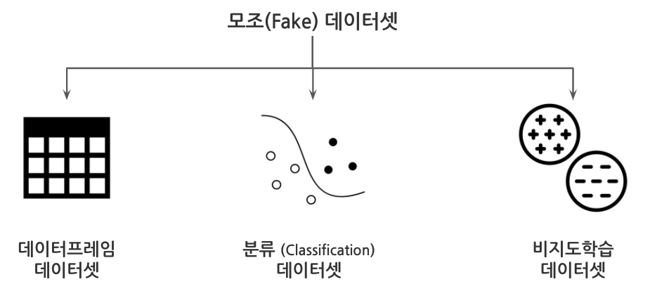

```{r setup, include=FALSE}
knitr::opts_chunk$set(echo = TRUE, message=FALSE, warning=FALSE,
                      comment="", digits = 3, tidy = FALSE, prompt = FALSE, fig.align = 'center')

```



# 분류 문제 모조 데이터셋 {#make-classification-fake-dataset}

`scikit-learn` 기계학습 팩키지에 기계학습용 모조 데이터셋을 생성시킬 수 있는 함수가 있다.
이를 통해서 다양한 분류 문제(Classification) 데이터셋을 생성시키고 다양한 기계학습 모형을 적합시켜 볼 수 있다.

- `n_samples` : 관측점 데이터의 갯수.
- `n_features` : 예측 변수(Feature)의 숫자.
- `n_informative` : 예측 변수(Feature) 중 목표(Target) 변수와 상관 관계가 있는 성분의 숫자.
- `n_redundant` : 예측 변수(Feature) 중 다른 예측 변수(Feature)의 선형 조합으로 표현되는 중복 변수 숫자.
- `n_classes` : 목표 변수(Target)의 범주(class) 숫자.
- `n_clusters_per_class` : 범주(class)별 군집(cluster)의 갯수
- `class_sep` : 범주 분리 계수, 기본설정값은 1로 되어 있고 값이 크면 클수록 범주가 섞이지 않고 명확하게 분리되어 분류기 개발이 쉬어진다.

2개의 범주를 예측하는 데이터셋으로 관측점이 1,000개, 예측변수(Feature)가 5개, 범주 내 별도 군집(cluster)는 없는 형태이며, 범주 분리계수는 3으로 뚜렷하게 범주가 분리되는 형태 데이터를 생성시킨다. 

```{python create-classification-dataset}
from sklearn.datasets import make_classification

x, y = make_classification(n_samples  = 1000,
                           n_classes  = 2,
                           n_features = 5,
                           class_sep  = 3,
                           n_clusters_per_class = 1)

print(x.shape)
```

파이썬에서 생성한 분류문제 데이터가 파이썬 행렬 객체이기 때문에 이를 데이터프레임으로 변환시키고 R `tidymodels`의 `embed` 팩키지를 사용해서 2차원으로 축소하고 난 후에 이를 `plotly`로 인터랙티브 시각화를 한다.

```{r umap-visualization}
library(reticulate)
library(tidymodels)
library(tidyverse)
library(embed)
library(plotly)

class_tbl <- py$x %>% as_tibble()

classification_umap_rec <- recipe( ~ ., data = class_tbl) %>%
  step_normalize(all_predictors()) %>% 
  step_umap(all_numeric(), num_comp = 2)  

classification_umap_tbl <- prep(classification_umap_rec) %>% juice(.)

classification_umap_tbl %>% 
  mutate(target = py$y) %>% 
  plot_ly(x = ~umap_1, y = ~umap_2, color = ~target, hoverinfo = 'text',
          text= ~glue::glue("x: {umap_1}<br>
                             y: {umap_2}<br>,
                             class: {target}")) %>% 
  add_markers(size=2) %>% 
  layout(showlegend = FALSE) %>% 
  hide_colorbar()  

```

# 비지도학습 문제 모조 데이터셋 {#make-unsupervised-fake-dataset}

지도학습이 아닌 비지도학습 

- `n_samples` : 관측점 데이터의 갯수
- `n_features` : 예측 변수(Feature)의 숫자.
- `centers` : 비지도학습 군집 갯수.
- `cluster_std`: 군집별 퍼짐 정도를 나타내는 표준편차.
- `center_box`: 군집 경계를 정의하는 상자정보 

예측변수(Feature) 5개, 군집 갯수는 3, 표준편차는 5를 갖는 관측점 5,000 개 비지도학습 문제를 위한 모조 Fake 데이터를 생성시킨다. 

```{python unsupervised-dataset}
from sklearn.datasets import make_blobs

unsupervised_x, unsupervised_labels = make_blobs(n_samples   = 5000,
                       n_features  = 5,
                       centers     = 3,
                       cluster_std = 5
)

print(x.shape)
```

앞서 분류문제 지도학습과 동일하게 R `tidymodels`를 통해 기계학습 예측모형을 개발하지 전에 시각화를 통해 가능성을 타진해보자.


```{r umap-visualization-unsupuervised}

unsupervised_tbl <- py$unsupervised_x %>% as_tibble()

unsupervised_umap_rec <- recipe( ~ ., data = unsupervised_tbl) %>%
  step_normalize(all_predictors()) %>% 
  step_umap(all_numeric(), num_comp = 2)  

unsupervised_umap_tbl <- prep(unsupervised_umap_rec) %>% juice(.)

unsupervised_umap_tbl %>% 
  mutate(label = py$unsupervised_labels) %>% 
  plot_ly(x = ~umap_1, y = ~umap_2, color = ~label, hoverinfo = 'text',
          text= ~glue::glue("x: {umap_1}<br>
                             y: {umap_2}<br>,
                             class: {label}")) %>% 
  add_markers(size=1) %>% 
  layout(showlegend = FALSE) %>% 
  hide_colorbar()
```


# 개인정보 가득 데이터셋 {#make-personal-dataset}

파이썬 [`Faker`](https://faker.readthedocs.io/en/master/) 팩키지를 사용해서 개인정보가 만땅으로 들어있는 데이터프레임을 제작해보자.
대한민국 시민 100명에 대한 개인정보를 이름, 주소는 물론 위경도 정보와, 성별, 전자우편주소, 회사와 직업, IP 주소, 그리고 가입날짜, 신용카드 번호, 생년월일, 연봉 등 나름 특정 금융기관에서 해킹해서 가져온 것처럼 실감있는 데이터를 생성한다.

```{python create-personal-dataset}
from faker import Faker
import pandas as pd
import numpy as np
import random
from datetime import datetime

fake = Faker('ko_KR')

def create_rows_faker(num=1):
    output = [{"name"       : fake.name(),
               "address"    : fake.address(),
               "latlng"     : fake.latlng(),
               "gender"     : np.random.choice(["M", "F"], p=[0.5, 0.5]),
               "email"      : fake.email(),
               "city"       : fake.city(),
               "company"    : fake.company(),
               "job"        : fake.job(),
               "ip_address" : fake.ipv4(network=False, address_class=None, private=None),
               "date_of_birth": fake.date_between_dates(date_start=datetime(1950,1,1), date_end=datetime(2000,12,31)).strftime("%Y-%m-%d"),
               "credit_card_full": fake.credit_card_full(card_type=None),
               "salary"     : np.random.lognormal(3, 1)} for x in range(num)]
    return output

df_faker = pd.DataFrame(create_rows_faker(100))

df_faker
```

위경도(`latlng`)는 다른 자료구조라 나중에 변환하기로 하고 개인정보가 만땅으로 들어간 데이터프레임을 살펴보자.

```{r reactable-dataframe}
personal_tbl <- py$df_faker %>% 
  as_tibble() %>% 
  select(-latlng)

personal_tbl %>% 
  reactable::reactable()
```


## 실감나는 범주형 변수 {#make-personal-dataset-categorical}

과거 남녀차별이 심하여 성비 분균형이 무척이나 심했다.
이런 사항을 반영하기 위해서 과거 데이터로부터 성비를 7:3으로 지정하고 이를 변수에 반영시킨다.

```{python make-categorical-variable}
gender_p = (0.7, 0.3)

df_faker['gender'] = np.random.choice(["M", "F"], size = 100, p = gender_p)
```

성비불균형 관련 범주형 변수 내용이 제대로 반영되었는지 확인한다.

```{r check-proportion}
py$df_faker %>% 
  as_tibble() %>% 
  count(gender) %>% 
  mutate(pcnt = n / sum(n))
```


## 실감나는 연속형 변수 {#make-personal-dataset-continuous}

연속한 변수 예를 들어 연봉같은 변수는 특정 변수를 따른다고 가정한다.
로그 정규분포를 앞에서 따른다고 가정해서 데이터를 추출했기 때문에 `scipy` 팩키지를 활용하여 모수를 추정하고 이를 데이터프레임에 다시 넣는다. 

```{python salary-income}
from scipy import stats

params = stats.lognorm.fit(df_faker['salary'])

df_faker['salary'] = stats.exponnorm.rvs(size = len(df_faker), *params)

df_faker['salary'] = df_faker['salary'].round()
```

R `ggplot`을 사용해서 연봉에 대한 소득분포가 어떤지 시각화한다.

```{r visualize-salary}
py$df_faker %>% 
  as_tibble() %>% 
  ggplot(aes(x=salary)) +
    geom_histogram()
```

